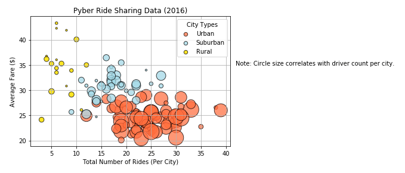

# The Power of Plots

## Pyber - Objective

What good is data without a good plot to tell the story?

So, let's take what you've learned about Python Matplotlib and apply it to some real-world situations.

The ride sharing bonanza continues! Seeing the success of notable players like Uber and Lyft, you've decided to join a fledgling ride sharing company of your own. In your latest capacity, you'll be acting as Chief Data Strategist for the company. In this role, you'll be expected to offer data-backed guidance on new opportunities for market differentiation.

You've since been given access to the company's complete recordset of rides. This contains information about every active driver and historic ride, including details like city, driver count, individual fares, and city type.

Your objective is to build a [Bubble Plot](https://en.wikipedia.org/wiki/Bubble_chart) that showcases the relationship between four key variables:

* Average Fare ($) Per City
* Total Number of Rides Per City
* Total Number of Drivers Per City
* City Type (Urban, Suburban, Rural)

In addition, you will be expected to produce the following three pie charts:

* % of Total Fares by City Type

* % of Total Rides by City Type

* % of Total Drivers by City Type

## Considerations

* Stick to the Pyber color scheme (Gold, Light Sky Blue, and Light Coral) in producing the plot and pie charts
* When making the Bubble Plot, experiment with effects like alpha, edgecolor, and linewidths
* When making the Pie Chart, experiment with effects like shadow, startangle, and explosion

## Observable Trends

* One trend we can see is that with more drivers there is more rides so the average fare tends to be much lower than places with less drivers so the average fare is much higher in rural than urban cities.
* Another trend is that urban cities tend to have many more drivers so the average fare is lower which in turn makes people more likely to get rides through the company so a large portion of total fares come from urban cities even though the average fare is much lower.
* And a final trend we can see is that drivers would more likely be in urban cities since there is more rides to be had since the fare price is such that people would more likely want to use the company and get a ride. that is why urban is the highest percentage for all the pies charts.
